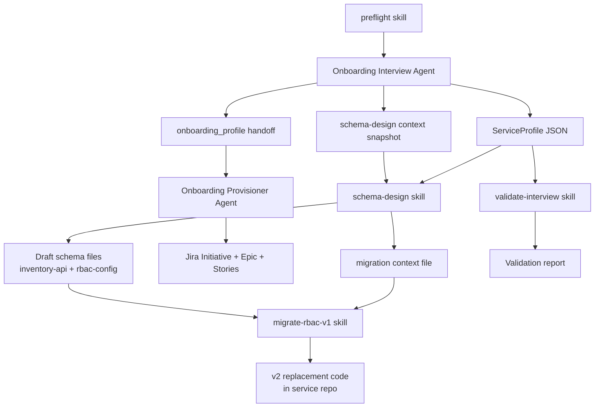

# Data flow

Full skill pipeline. Interview Agent v1 implements the intake branch; schema-design, migrate-rbac-v1, and validate-interview are standalone skills. Provision and schema-design/migrate are independent branches from the interview — provision only needs the handoff to create Jira tracking issues; schema-design and migrate are implementation tools that execute the work those issues track.

## Artifacts

| Artifact | Producer | Consumer | Location |
|----------|----------|----------|----------|
| ServiceProfile JSON | `onboarding-interview-conduct` | suggest-patterns, dedup, handoff, schema-design, validate-interview, provisioner | `{artifacts_dir}/profiles/{slug}-profile.json` |
| Narrative summary | `onboarding-interview-conduct` | EM review | `{artifacts_dir}/profiles/{slug}-summary.md` |
| `onboarding_profile` handoff | `onboarding-format-handoff` | Provisioner Agent | `{artifacts_dir}/profiles/{slug}-handoff.md` |
| Schema-design context snapshot | `onboarding-interview` (Gate 2 "later") | `onboarding-schema-design` (resume) | `{artifacts_dir}/profiles/{slug}-schema-context.md` |
| Draft resource schemas | `onboarding-schema-design` | Team PR to inventory-api | `{artifacts_dir}/schemas/{slug}/inventory-api/` |
| Draft permissions schemas | `onboarding-schema-design` | Team PR to rbac-config | `{artifacts_dir}/schemas/{slug}/rbac-config/` |
| Validation report | `onboarding-validate-interview` | Kessel PM / interview skill improvement | `{artifacts_dir}/validation/{slug}-validation-report.md` |
| Migration context file | `onboarding-schema-design` (Gate 2 "migrate later") | `onboarding-migrate-rbac-v1` (resume) | `{artifacts_dir}/schemas/{slug}/migrate-context.md` |
| v2 replacement code | `onboarding-migrate-rbac-v1` | Service team PR review | service repo working tree (uncommitted) |

## Handoff contract: `onboarding_profile`

Schema version **1.2**. Defined in [skills/onboarding-format-handoff/handoff-schema.md](../skills/onboarding-format-handoff/handoff-schema.md). Accepts 1.0, 1.1, or 1.2; new fields absent on earlier-version profiles are treated as null.

Required fields for Provisioner (Track B):

- `provider`, `service`, `jira.home_project`, `jira.feature_epic_key`
- `program.wave`, `program.path` (`self-service` | `paired`)
- `patterns[]`
- `ui_access_checks`
- `dedup.status` (`clean` | `duplicate_found` | `reuse_initiative`)
- `contacts` (PM, EM, tech lead)
- Path to ServiceProfile JSON

## Skill sequence (Interview Agent)

1. `onboarding-interview-conduct` — Phase 0/1 Q&A → ServiceProfile (patterns/gates empty)
2. `onboarding-interview-suggest-patterns` — KSL-016 → fills `patterns`, `platform_gates`, may set `program.path`
3. `onboarding-dedup-epic` — JQL → dedup report on profile
4. **Human gate** — EM approves profile
5. `onboarding-format-handoff` — approved `onboarding_profile` block

## Deferred agents

| Agent | Track | Skills |
|-------|-------|--------|
| Phase Coach | D | `onboarding-assess-phase-readiness`, `onboarding-generate-next-actions` |
| Blocker Triage | D | `onboarding-classify-blocker`, `onboarding-create-blocker-issue` |
| Docs Agent | C | `onboarding-detect-docs-gap`, `onboarding-draft-docs-pr` |
| Technical enablement skills | C/E | see [docs/technical-enablement-recommendations.md](technical-enablement-recommendations.md) (engineering-owned) |

## Changelog

- 2026-08: Added `onboarding-migrate-rbac-v1` to the flow diagram and artifacts table; added migration context file and v2 replacement code artifacts.
- 2026-07: Added `onboarding-schema-design` and `onboarding-validate-interview` to the flow diagram and artifacts table; added schema-design context snapshot artifact.
- 2026-07: Bumped handoff schema version reference to 1.2 (accepts 1.0, 1.1, or 1.2).
- 2026-07: Removed `platform_gates[]` from the Provisioner-required field list — the Provisioner no longer reads it (Jira gate-linking was removed). `platform_gates[]` is still filled on the profile by `onboarding-interview-suggest-patterns` for its own confidence-cap logic.
- 2026-07: Bumped handoff schema version reference to 1.1 (accepts 1.0 or 1.1) and added the deferred technical enablement skills row.

Assisted-by: Claude (Anthropic)
